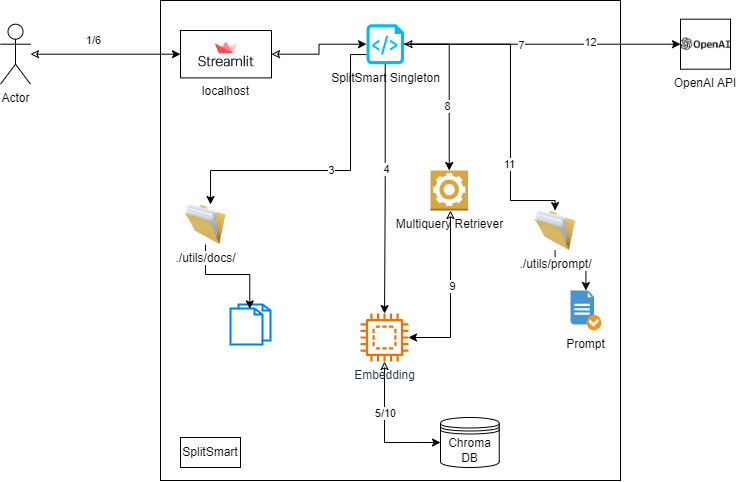

# SplitSmart
Repo Git for SplitSmart chatbot powered by LLM

## Overview

### Description
The project represents a chatbot powered by LLM that aims to answer questions related to two civil code documents concerning inheritance and asset division after divorce.
The application will ask you to choose at the beginning the model with which to embed the queries/documents. the version of GPT to be used to generate the response and the corresponding Open AI key.
During the first run, if there is no embedding for the documents, the documents will be ingested and their embedding calculated and then saved to a local vector database (Chroma DB).

When a query is made by the user the first step will be to obtain its the embedding, through a multiquery retriever the embedded value of the query and the documents embedding will then be compared and the documents most relevant to the topic will be retrieved from the DB vector.

At this point the retrieved documents should be concatenated to a default prompt. The result of this concatenation will then be passed as an API request message to OpenAI's previously chosen GPT engine.

GPT's response will then be returned to the user.

### Architecture

