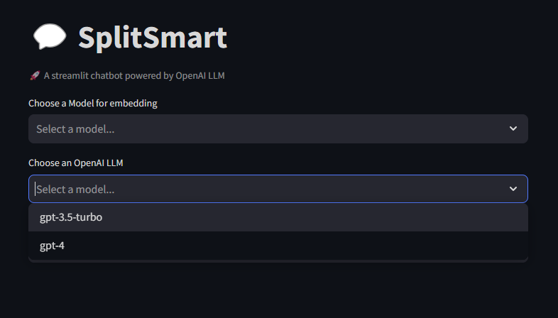

# SplitSmart
Repo Git for SplitSmart chatbot powered by LLM

## Overview

The project represents a chatbot powered by LLM that aims to answer questions related to two civil code documents concerning inheritance and asset division after divorce.




The application will ask you to choose at the beginning the model with which to embed the queries/documents. the version of GPT to be used to generate the response and the corresponding Open AI key.
During the first run, if there is no embedding for the documents, the documents will be ingested and their embedding calculated and then saved to a local vector database (Chroma DB).

When a query is made by the user the first step will be to obtain its the embedding, through a multiquery retriever the embedded value of the query and the documents embedding will then be compared and the documents most relevant to the topic will be retrieved from the DB vector.

GPT's response will then be returned to the user.

## Architecture


## Workflow

Following are the steps in the process:

1.  The user will set up the environment, It will pass to the application the following three parameters:
    -   Model used for the embedding (queries + docs)
    -   OpenAI API key
    -   Version of GPT to use for the interaction
2.  The Streamlit App for the first run will take the parameters and will instantiate a Singleton of SplitSmart.
3.  Only if no embeddings are found the Singleton will be used to ingest the documents stored in the project subfolder /utils/docs and split them in chunks
4.  The Singleton will invoke the Embedding Model chosen for perform the embeddings over the chunks previously created
5.  the resulting embeddings will be stored into a local persisten ChromaDB (which will be loaded for the next executions)
6.  At this point the user will be able to ask the questions
7.  Each question at the first will be sent to OpenAI API for being translated in English since the docs are in English and the similarity search could loss accuracy
8. The translated query then will be passed to the multiquery retriever created by the Singleton
9. The retriever will take the query (in English) and will perform the same embedding of the documents
10. The embedding of the query will be compared with the embeddings of the documents stored on Chroma and a similarity search will retrieve the most relevant ones
11. The Singleton at thi point will combine the documents retrieved with a prompt stored locally (RAG approach)
12. The input (prompt + docs) will be passed as input text to the OpenAI API, finally the response will be visualized by the final user

## Technical Description

### Streamlit
The front-end is implemented in Streamlit, by nature of the application the code is re-executed at each user interaction, to keep some values (such as input parameters) consistent between executions steramlit state variables are used.

### SplitSmart
The application is designed as a Singleton, this choice was made on the basis of front-end behavior: with continuous page refresh there is a risk of instantiating multiple instances of the application, by modeling the class as a Singleton a new instance will be created only on the first run of the application.

### Documents & chunking
The documents to be ingested are in English and are divided into civil code articles.
For the chunking process, it was decided by logic to create a chunk for each article (so as to draw the semantic boundary to the individual articles of the code).

During indexing each chunk is also hooked with metadata described below: 

```json
{
"page_content": "Civil Code Article",
"metadata" :{
            "doc_name": "name of the Document from which the article comes",
            "article_number": "Number of the article of the civil code",
            "title": "Title of the article contained in page_content"
        }
}
```

### Embedding
The model used for the embeddings is a sentece-transformer from HuggingFace repo, at the moment the model used is multi-qa-MiniLM-L6-cos-v1 (more information about the model in the References section). It will embed the several chunks and will store the resulting embeddings with its own indexed metadata.

### Vector DB
As the simplest solution to store embeddings, Chroma DB was used, specifically a persistent partition was created to keep the embeddings stored between runs and not have to ingest the documents each time.

### Semantic Search
A langchain multiquery retriever is used to perform the semantic search. The operation is as follows:

Rather than performing the embedding of the user's single request and performing the semantic search on the DB by retrieving the K most similar documents, it uses an LLM to generate 4 different versions of the input request.
It then uses the 5 inputs to perform 5 separate semantic searches, taking the top results for each (K=1 for each search).
This can increase the variability of the semantic search with respect to the initial query. By generating different versions of the same query they can better capture embeddings of articles written with different words than those used in the query.

### Prompt
The result of the semantic search will populate a prompt that should guide the LLM in generating the response. The approach used, as mentioned above, is that of RAG: thus, the documents from the semantic search will go to make up the knowledge base that the LLM must use to answer the question.
The prompt is templatized and placed within the project folder under the utils.

## Github Repository Structure
```
.
├── LICENSE                         -> LICENSE
├── MakeFile                        -> MakeFile of the project
├── README.md                       -> README file
├── img                             -> images of the documentation
│   ├── SplitSmart.drawio
│   ├── SplitSmart.png
│   └── screen
│       └── SplitSmartLanding.png
├── requirements.txt                -> requirements of the project
└── sample                          -> project main folder
    ├── chatbot_app.py              -> Streamlit app
    ├── ss_chatbot                  -> Singleton Python package
    │   ├── __init__.py
    │   └── chatbot.py
    └── utils
        ├── docs                    -> Documents to ingest
        │   ├── DIVISION OF ASSETS AFTER DIVORCE.txt
        │   └── INHERITANCE.txt
        ├── prompt                  -> Prompt to use for generating the LLM input
        │   └── lawyer.txt
        └── starting_message.txt    -> Starting message to visalize
```


### References
-   [Streamlit](https://streamlit.io/)
-   [Singleton Design Pattern](https://it.wikipedia.org/wiki/Singleton_(informatica))
-   Embedding Model: [multi-qa-MiniLM-L6-cos-v1](https://huggingface.co/sentence-transformers/multi-qa-MiniLM-L6-cos-v1)
-   [Chroma DB](https://www.trychroma.com/)
-   [LangChain MultiQueryRetriever](https://python.langchain.com/docs/modules/data_connection/retrievers/MultiQueryRetriever)
-   [RAG](https://python.langchain.com/docs/expression_language/cookbook/retrieval)


